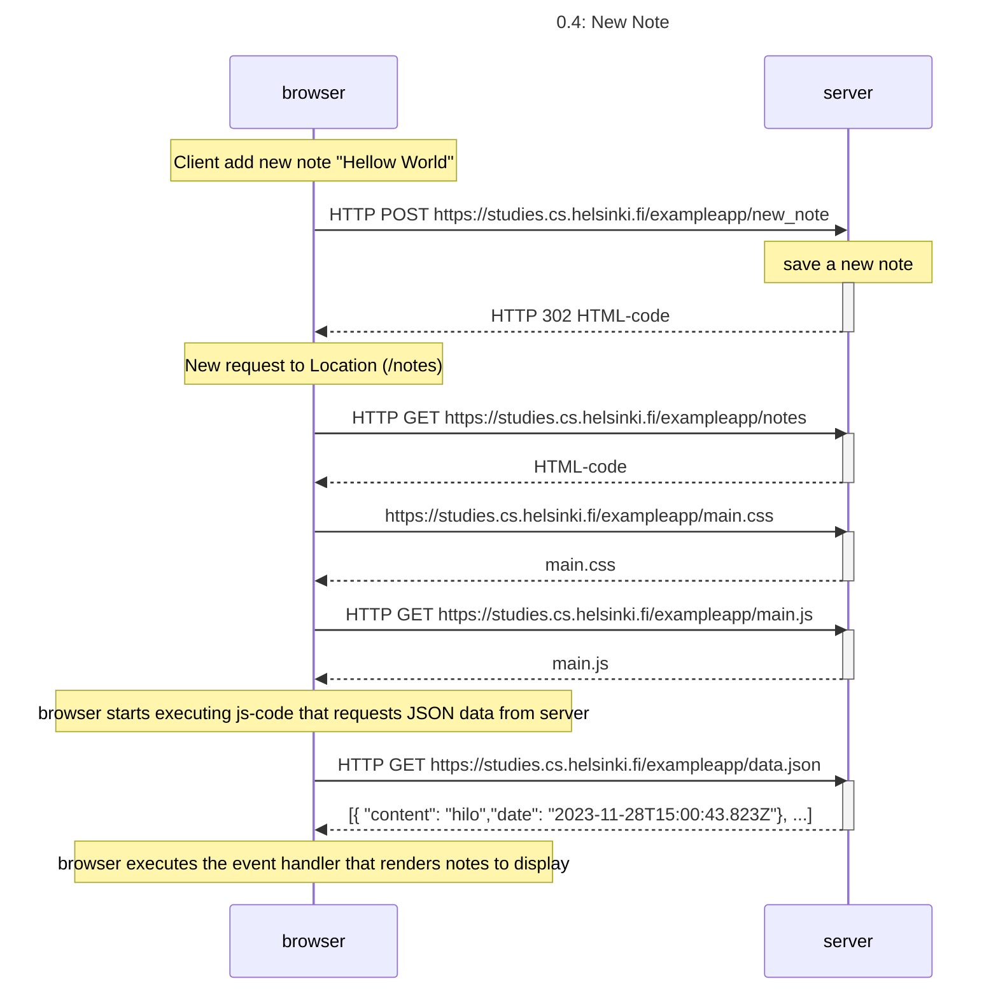

```mermaid
sequenceDiagram
    Title: 0.4: New Note

    participant browser
    participant server

    note over browser: Client add new note "Hellow World"
    browser->>server: HTTP POST https://studies.cs.helsinki.fi/exampleapp/new_note
    note over server: save a new note
    activate server
    server-->>browser: HTTP 302 HTML-code
    deactivate server
    note over browser: New request to Location (/notes)
    browser->>server: HTTP GET https://studies.cs.helsinki.fi/exampleapp/notes
    activate server
    server-->>browser: HTML-code
    deactivate server
    browser->>server: https://studies.cs.helsinki.fi/exampleapp/main.css
    activate server
    server-->>browser: main.css
    deactivate server
    browser->>server: HTTP GET https://studies.cs.helsinki.fi/exampleapp/main.js
    activate server
    server-->>browser: main.js
    deactivate server

    note over browser: browser starts executing js-code that requests JSON data from server

    browser->>server: HTTP GET https://studies.cs.helsinki.fi/exampleapp/data.json
    activate server
    server-->>browser: [{ "content": "hilo","date": "2023-11-28T15:00:43.823Z"}, ...]
    deactivate server
    note over browser: browser executes the event handler that renders notes to display
```