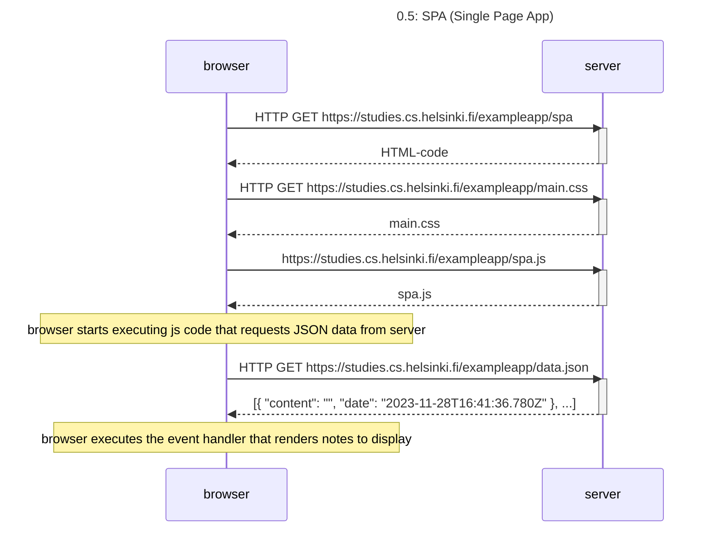

```mermaid
sequenceDiagram
    Title: 0.5: SPA (Single Page App)

    participant browser
    participant server

    browser->>server: HTTP GET https://studies.cs.helsinki.fi/exampleapp/spa
    activate server
    server-->>browser: HTML-code
    deactivate server
    browser->>server: HTTP GET https://studies.cs.helsinki.fi/exampleapp/main.css
    activate server
    server-->>browser: main.css
    deactivate server
    browser->>server: https://studies.cs.helsinki.fi/exampleapp/spa.js
    activate server
    server-->>browser: spa.js
    deactivate server
    note over browser: browser starts executing js code that requests JSON data from server

    browser->>server: HTTP GET https://studies.cs.helsinki.fi/exampleapp/data.json
    activate server
    server-->>browser: [{ "content": "", "date": "2023-11-28T16:41:36.780Z" }, ...]
    deactivate server
    note over browser: browser executes the event handler that renders notes to display
```