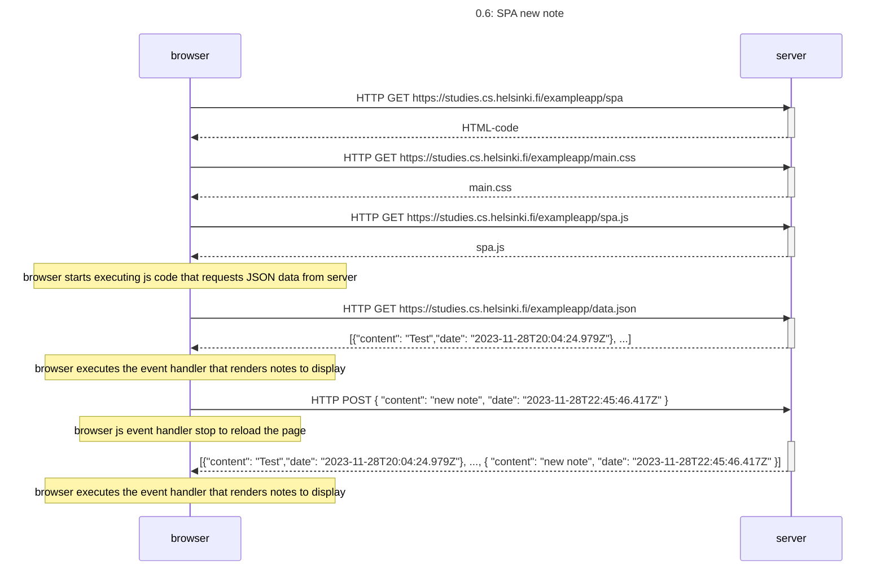

```mermaid
sequenceDiagram
    Title: 0.6: SPA new note

    participant browser
    participant server

    browser->>server: HTTP GET https://studies.cs.helsinki.fi/exampleapp/spa
    activate server
    server-->>browser: HTML-code
    deactivate server
    browser->>server: HTTP GET https://studies.cs.helsinki.fi/exampleapp/main.css
    activate server
    server-->>browser: main.css
    deactivate server
    browser->>server: HTTP GET https://studies.cs.helsinki.fi/exampleapp/spa.js
    activate server
    server-->>browser: spa.js
    deactivate server

    note over browser: browser starts executing js code that requests JSON data from server

    browser->>server: HTTP GET https://studies.cs.helsinki.fi/exampleapp/data.json
    activate server
    server-->>browser: [{"content": "Test","date": "2023-11-28T20:04:24.979Z"}, ...]
    deactivate server
    note over browser: browser executes the event handler that renders notes to display

    browser->>server: HTTP POST { "content": "new note", "date": "2023-11-28T22:45:46.417Z" }

    note over browser: browser js event handler stop to reload the page
    activate server
    server-->>browser: [{"content": "Test","date": "2023-11-28T20:04:24.979Z"}, ..., { "content": "new note", "date": "2023-11-28T22:45:46.417Z" }]
    deactivate server
    note over browser: browser executes the event handler that renders notes to display
```